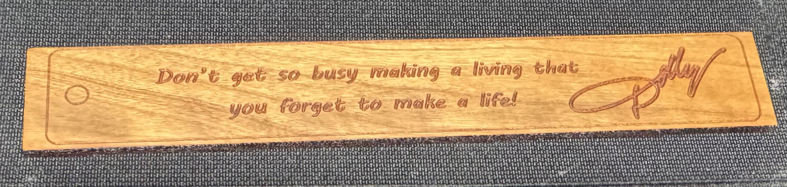

# Epilog Studio

> **DISCLAIMER:** This is unofficial, community-developed software. This project is not affiliated with, endorsed by, or sponsored by Epilog Laser. Use at your own risk. The authors assume no liability for any damage to your equipment, materials, or property, or for any personal injuries. Always follow proper laser safety procedures.

[](https://github.com/leftouterjoins/EpilogDriver/actions/workflows/ci.yml)
[](https://github.com/leftouterjoins/EpilogDriver/releases)
[](https://www.gnu.org/licenses/lgpl-3.0)

A macOS application for driving Epilog Zing laser engravers, plus the CUPS
printer driver it grew out of.

**Epilog Studio** is the application: open a PDF, SVG or image, lay it out on a
drawing of the bed, and say what happens to each colour in it. **The printer
driver** adds the Zing to Printers & Scanners, for when a document is already
laid out and you just want to hit Print.

> **Note:** The wire protocol here began as a Swift port of the Epilog driver
> from [LibLaserCut](https://github.com/t-oster/LibLaserCut), originally written
> in Java by Thomas Oster and contributors.

## First test



*The first test engraving done with this project.*

## Supported models

| Model | Engraving area |
|-------|----------------|
| Epilog Zing 16 | 16" x 12" (406 x 305 mm) |
| Epilog Zing 24 | 24" x 12" (610 x 305 mm) |

## Installation

1. Download the latest `.pkg` from [Releases](https://github.com/leftouterjoins/EpilogDriver/releases)
2. Double-click it and follow the prompts

That installs **Epilog Studio** into your Applications folder and the printer
driver into the system. Nothing else needs doing — no Terminal, no CUPS
commands.

The package is not notarised, so the first launch needs Control-click → Open,
or **System Settings → Privacy & Security → Open Anyway**.

<details>
<summary>From source</summary>

```bash
git clone https://github.com/leftouterjoins/EpilogDriver.git
cd EpilogDriver

Installer/build-app.sh --open   # just the application
make release && sudo make install   # just the driver
make package                    # the installer package, containing both
```
</details>

---

# The application

Open **Epilog Studio**, put your laser's IP address in the **Machine** section
of the inspector (the laser shows it on its own display, under Network), then
drag artwork onto the bed.

## How it works

Everything in the application follows from one idea: **a colour is a
instruction.** Drop in a file and every distinct colour in it becomes a layer.
Each layer has its own row in the table at the bottom of the window, and its own
operation, power, speed, frequency and pass count.

| Operation | What it does |
|-----------|--------------|
| **Cut** | Follows the outline at cutting power |
| **Score** | Follows the outline at low power, for fold lines and guides |
| **Engrave** | Burns the artwork as a bitmap, sweeping back and forth |
| **Skip** | Ignores that colour entirely |

Colours are assigned sensibly when a file arrives — the six saturated colours
(red, green, blue, cyan, yellow, magenta) become cuts, everything else engraves
— so a file marked up the usual way needs no configuration. Change any of it.

**Layers run top to bottom, and that order is a decision.** Scoring above
cutting means the scoring happens while the part is still held by its material;
the other way round scores a piece that has already dropped. Travel
optimisation reorders paths *within* a layer and never across, so it cannot
quietly undo that. The arrows under the layer table move a layer up or down.

Engraving layers additionally choose between:

- **Shaded** — keeps the artwork's own tone. A photograph stays a photograph.
- **Solid** — burns the shape at full darkness whatever colour it is. What you
  want for a logo drawn in pale yellow, which is not meant to engrave faintly.

## The canvas shows what will burn

Not what the file looks like. The two differ exactly where it matters: a shape
routed to the cutter appears as an outline rather than the filled red blob it is
in the document, a layer switched off vanishes, a layer set to solid goes black.
Somebody about to spend a sheet of walnut should be looking at the second
picture.

Drag artwork to move it, corner handles to scale. **Drag on empty space to
sweep out a selection** — anything the band touches is caught, and holding shift
adds to what is already selected. Shift-click adds one at a time.

Pan with two fingers, by holding space and dragging, or with the middle mouse
button; pinch or ⌘-scroll to zoom. **Right-click** anywhere on the bed
for everything that applies to what is under the pointer — or, on empty space,
for adding artwork, zooming and the view options.

**Arrow keys nudge** the selection a point at a time, or ten with shift held;
delete removes it. Neither is bound in the menu bar on purpose — a menu key
equivalent is matched before the field you are typing in gets a look, so a bare
delete there would wipe your artwork while you were renaming a layer.

**⌘0 fits the bed**, ⇧⌘0 fits the selection, ⌘1 is 100%; there are matching
buttons in the bottom-right corner. The pointer position reads out in inches
from the bed's top-left corner, which is where the laser's own origin is.

The **Arrange** menu has the usual align, distribute, centre, fit and rotate,
plus:

- **Split into Parts** (⌘J) — breaks one file into its separate objects so you
  can move, rearrange and delete them individually. Three bookmarks on a sheet
  become three things you can spread across an offcut. You choose how far apart
  counts as separate, and the sheet shows how many parts you would get before
  you commit. Holes stay with the outline they belong to.
- **Make Array** (⌘K) — a grid of copies with a gap you measure on your
  material, for when you are cutting twenty of the same part.

Everything undoes (⌘Z). A whole drag is one step, not one per frame.

**White backgrounds are dropped on import.** Drawing programs put a white
rectangle behind the artwork whenever a canvas has a background colour. It is
not artwork, and left in place it would become a layer, default to a solid
engrave because it is pale, and burn a page-sized black rectangle. The log says
when one was ignored.

## Before you burn

Two things worth doing, in order.

**Show Toolpath** (⌘Y) plays the job back: the engraving sweeping down each
region first, then every cut in its layer colour in the order the machine will
make them, with the head's repositioning shown as dashed grey. Engraving before
cutting is the real order — the raster section of a job precedes the vector one.
This is where you notice that an outline gets cut before the holes inside it,
the mistake that drops a part mid-job and lands everything after it in the wrong
place. Scrub or press play.

**Trace outline** (⇧⌘T) then runs the head around the job on the real machine
with the laser off, so you can watch where it will land and slide your material
into place. Zero power is deliberate: with the beam off the lid interlock still
allows head movement, so the lid can stay open while you do it.

The inspector shows an estimate, the job's extent, and warnings — including the
one that matters most, that a flattened image has no outlines and nothing will
cut.

## What it reads

| Format | Cuts | Engraves | Notes |
|--------|------|----------|-------|
| **SVG** | yes | yes | The best input. Shapes, groups, transforms and the full path grammar. Live `<text>` is not read — convert it to outlines first, and the app will tell you if you forgot. |
| **PDF** | yes | yes | Vector shapes become cuttable layers; text, photographs and gradients engrave from the page itself. |
| **PNG / JPEG / TIFF** | no | yes | No outlines exist in a bitmap, so there is nothing to cut. Read at the image's own DPI. Supported, but PDF and SVG are what this is built around. |

Multi-page PDFs let you choose the page in the inspector.

## Materials

The application ships with **no material settings**, on purpose. A table of
power and speed values is only worth anything if it came off your machine, with
your tube at its current age, on your supplier's material — shipping invented
numbers under names like "plywood" would be a confident way of wasting your
afternoon.

So you build the library. Dial in settings that cut cleanly on a scrap, then
**Save current…** under Material. Applying a saved entry sets every layer
according to its role, rescaling the speeds if the numbers were measured on a
machine of a different wattage — a starting point, not a promise.

**Manage…** edits, duplicates and deletes them.

## Two kinds of file

They are easy to mix up, so:

| | What it is | Reopen it? |
|---|---|---|
| **Save Project** (⌘S) → `.epilogjob` | Your work: machine, layers, power and speed, where everything sits on the bed, and *references* to your PDFs and SVGs. | Yes — that is the point |
| **Export Machine File** (⇧⌘E) → `.prn` | The finished instruction stream the laser receives: PJL, PCL and HPGL, artwork already reduced to dots and coordinates. | No |

The project file stores references rather than copies, so editing the artwork
in the application that drew it and reopening the project picks up the new
version. Keep the project next to its artwork and both travel together.

`.prn` is the old Windows convention for "printer file" — whatever a particular
printer happens to speak, which for a Zing is the byte stream above. You want it
for three things: sending a job from a computer that does not have this
application, keeping a copy of a job that is known to have cut correctly, and
looking at what was actually produced when something comes out wrong. Send one
with:

```bash
tools/send_lpd.py job.prn --host 192.168.1.50
```

## From a script

```bash
"/Applications/Epilog Studio.app/Contents/MacOS/EpilogStudio" \
    --render part.svg --send 192.168.1.50
```

| Option | |
|--------|--|
| `--render FILE` | artwork to prepare |
| `-o, --output FILE` | write the job to a file instead of standard output |
| `--send HOST` | send it to a laser at this address |
| `--frame` | trace the outline instead of running the job |
| `--dpi N` | engraving resolution, default 500 |
| `--machine ID` | `zing24` or `zing16` |

Layers get their default assignment. Open the file in the application to change
that.

---

# The printer driver

Prints to the laser from any application, through the normal print dialog.

## Adding the printer

**System Settings → Printers & Scanners → +**, then the **IP** tab:

- **Address:** your laser's IP (factory default `192.168.3.4`)
- **Protocol:** Line Printer Daemon - LPD
- **Queue:** leave empty
- **Use:** "Epilog Zing 16" or "Epilog Zing 24"

## Print settings

| Setting | Range | Description |
|---------|-------|-------------|
| Resolution | 100-1000 DPI | Higher = finer detail, slower |
| Raster Power | 1-100% | Laser power for engraving |
| Raster Speed | 1-100% | Head movement speed |
| Raster Mode | Standard/3D | 1-bit bitmap or 8-bit greyscale |
| Vector Power | 0-100% | Laser power for cutting |
| Vector Speed | 1-100% | Cutting speed |
| Vector Frequency | 500-5000 Hz | Pulse frequency |
| Dithering | None/Ordered/Floyd-Steinberg/Jarvis/Stucki | How continuous tone becomes dots |
| Test Frame | Off/Trace/Mark | Outline where the job will land, for positioning material |

### What gets cut vs engraved

The driver has no interface for deciding this, so it has to infer it. A shape is
**vector cut** if either rule matches:

| Rule | Applies to | Example |
|------|-----------|---------|
| **Colour** | Strokes and fills painted red, green, blue, cyan, yellow or magenta | A cyan outline of any thickness |
| **Hairline** | Strokes ≤0.25pt (0.0035") wide, any colour | A 0.1pt black outline |

Everything else is **raster engraved** — black artwork, greys, photos, text.

Shapes routed to the cutter by colour are excluded from the engrave, so they are
not burned twice. Per-colour power, speed and frequency can be set individually
in the print dialog, which is why colour is the more useful of the two rules.

Two things worth knowing:

- **Printing from an application that flattens its output produces no cuts.**
  Pixelmator Pro composites its canvas to a bitmap when printing, so the spooled
  document contains no paths at all. Export to PDF and print that instead — or
  open the file in Epilog Studio, which warns about this in plain language.
- **A hairline in a non-cut colour is both cut and engraved.** Only
  colour-routed shapes are removed from the raster.

### Job handling

| Setting | What it does |
|---------|--------------|
| Vector Sorting | Cuts each part's interior geometry before the outline that encloses it, so a part cannot drop or shift part-way through the job, then orders parts nearest-first to cut wasted travel. On by default. |
| Mirror | Flips the job horizontally, vertically or both. Needed when engraving the back face of clear material, where the artwork is read through the substrate. |
| Material Width / Height | The size of the stock on the bed. Purely a safety check: the driver warns before running if the job would fall outside it. |
| Color Mapping | Sends a per-colour power and speed table so coloured areas *engrave* at different settings. Per-colour cutting already works without this. Off by default — the commands are read out of Epilog's own Windows driver but have not been confirmed against hardware. |

### Test Frame

| Mode | What it does |
|------|--------------|
| Off | Runs the real job |
| Trace | Moves the head around the bounding box with the laser off |
| Mark | Same path at 8% power, leaving a faint outline |

Run once with Trace, watch where the head goes, reposition your stock, then run
again with Test Frame set to Off. Trace sends zero power on purpose so the lid
can stay open; Mark fires the laser, so the lid has to be closed for it.

The frame replaces the job entirely — nothing is engraved or cut while it is on.

---

## Network setup

- Factory default Epilog IP: `192.168.3.4`
- Protocol: LPD (Line Printer Daemon), port 515
- Your Mac and the laser must be on the same network

## Building

Needs macOS 12 or later, the Xcode Command Line Tools, and Swift 5.9+.

```bash
make build           # debug
make release         # universal binary
make test            # unit tests
make package         # installer package (application + driver)
sudo make install    # install the driver
sudo make uninstall  # remove it

Installer/build-app.sh [--debug] [--open]   # just the application
```

## Project structure

```
EpilogDriver/
├── Sources/
│   ├── EpilogKit/          # Shared core
│   │   ├── Artwork.swift            # what a document contains
│   │   ├── PDFArtworkImporter.swift # PDF -> coloured geometry
│   │   ├── SVGArtworkImporter.swift # SVG -> coloured geometry
│   │   ├── LaserLayer.swift         # what happens to each colour
│   │   ├── LaserProject.swift       # the bed and what is on it
│   │   ├── BedRasterizer.swift      # one engraving pass -> pixels
│   │   ├── JobBuilder.swift         # -> the bytes the laser reads
│   │   ├── PJL/Raster/VectorEncoder # the wire protocol
│   │   └── LPDClient.swift          # sending it
│   ├── EpilogStudio/       # The application
│   ├── RasterToEpilog/     # The CUPS filter
│   ├── EpilogUSB/          # CUPS USB backend
│   └── CUPSBridge/         # C bridging for CUPS
├── PPD/                    # Printer description files
├── Installer/              # Packaging
├── tools/                  # Protocol decoders and test utilities
└── Tests/
```

## Uninstalling

Open Finder, press ⌘⇧G, go to `/Library/Printers/Epilog`, and double-click
**Uninstall Epilog Driver.command**. That removes the application and the driver
both; your preferences and saved jobs are left alone.

## Troubleshooting

**The laser does not respond.** Check `ping 192.168.3.4`, that port 515 is
reachable, and that the machine is powered on. Epilog Studio's **Test
connection** button under Machine reports exactly which of those failed.

**It engraved but did not cut.** Almost always means the document had no
outlines to cut — see "What gets cut vs engraved" above. Epilog Studio says so
before you send.

**Driver logs:**

```bash
tail -f /var/log/cups/error_log
```

**Application logs:** the log panel in the window (⌘-click the toolbar's log
button, or View → Show Log).

## Contributing

Fork, branch, commit, push, open a pull request.

## License

LGPL-3.0 — see [LICENSE](LICENSE).

This project is a derivative work of
[LibLaserCut](https://github.com/t-oster/LibLaserCut) and is licensed under the
same terms.

## Acknowledgments

- Based on [VisiCut's LibLaserCut](https://github.com/t-oster/LibLaserCut) Epilog driver by Thomas Oster
- Uses Apple's CUPS printing system

## Related projects

- [VisiCut](https://github.com/t-oster/VisiCut) — laser cutter control software
- [LibLaserCut](https://github.com/t-oster/LibLaserCut) — Java library for laser cutters
